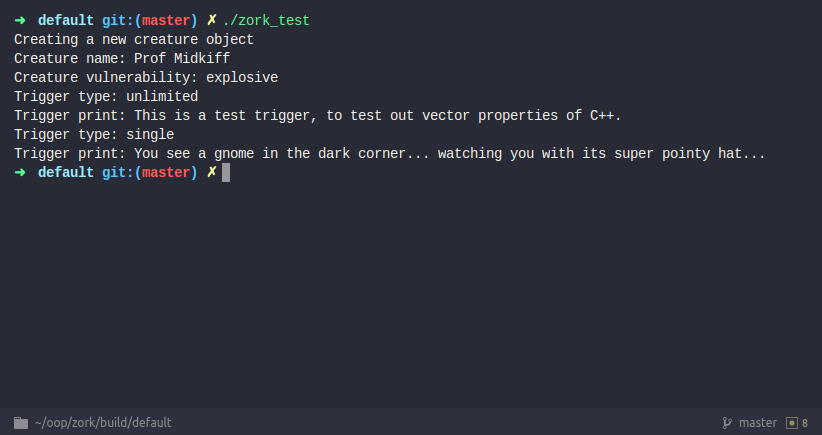
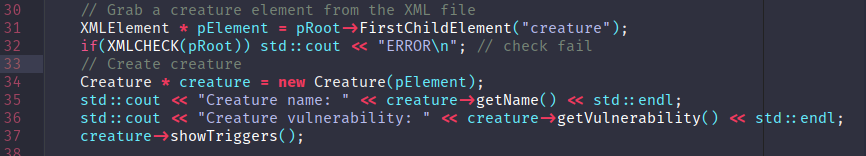

# Zork
> Implementation of classic game "Zork" for ECE30862: Object Oriented Programming w/ C++ and Java  
## Team
* Jeffrey Geiss  
* Andrew St. Pierre  

## Build notes  
* I needed to manually copy the XML file to the ```/zork/build/default/``` directory to properly access it   
### Build steps  
1. ```mkdir -p ~/zork/build/default``` to create a destination for generated files
2. ```cd build/default```
3. ```cmake -GNinja ../..``` to generate all the files for build tool
4. ```ninja``` to build and run our executable from the build folder
5. ```./zork_test``` to execute ```main.cpp```

## Screenshots  




## Resources
* https://shilohjames.wordpress.com/2014/04/27/tinyxml2-tutorial/  


### End README.md
